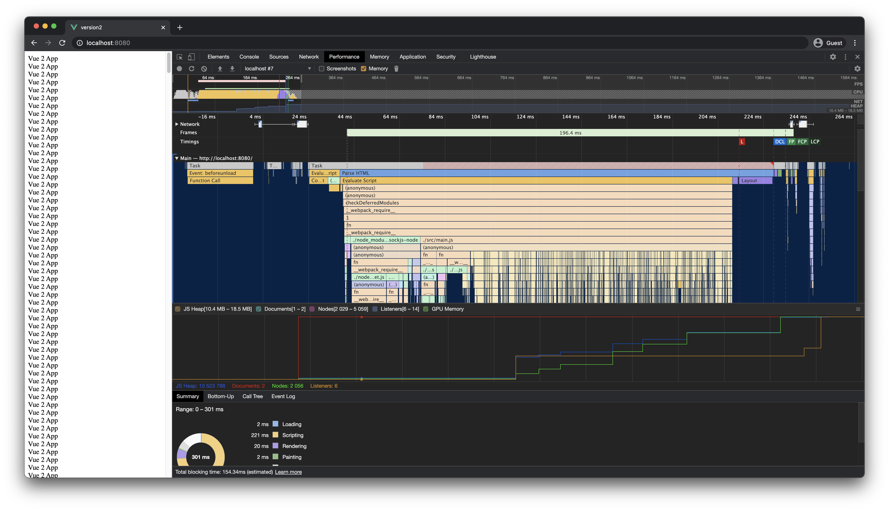
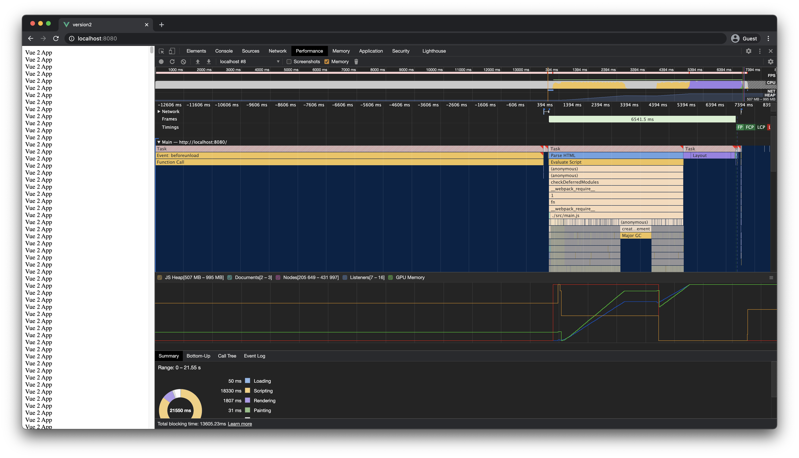
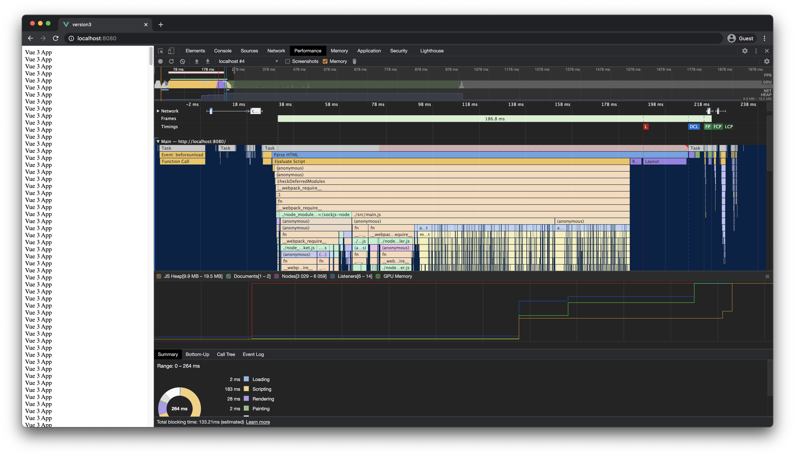
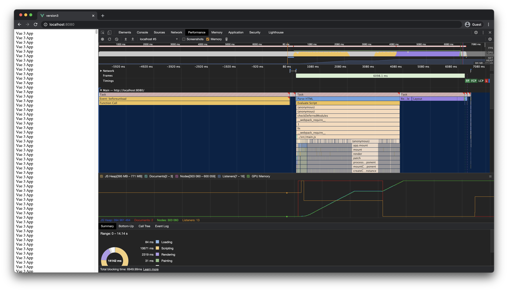

# Vue instances performance test

## How to test

The instructions are identical to both "version2" and "version3" directories. 

- Run `npm install`.
- Adjust the `INSTANCE_COUNT` value in "main.js".
- Run `npm serve` to start the local server.
- Go to [localhost:8080](http://localhost:8080).
- Open the developer console and play around in the Performance tab.

## Approximate results on my machine

Peak memory used:

| Version | 1k instances | 100k instances |
|---------|--------------|----------------|
| v2 | 18.5 MB | 995 MB |
| v3 | 19.5 MB | 771 MB |

## Version 2

### 1k instances

### 100k instances

## Version 3

### 1k instances

### 100k instances

